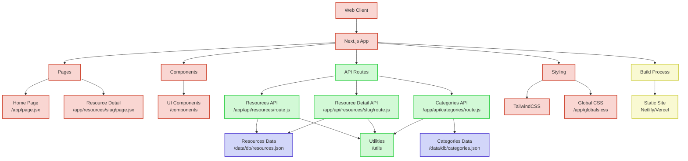

# DevHub

## Demo

- [Frontend]()
- [Backend]()

## Project Architecture


[Learn more](./architecture-diagram.md) about the architecture diagram. ([Spanish](./architecture-diagram-es.md))

## Features

- **Resource List**: Browse all developer resources with search and category filtering
- **Resource Details**: View detailed information about each developer resource including:
  - Name
  - Description
  - URL
  - Categories
  - Keywords

## Technologies Used

- **Next.js 13**: React framework with App Router
- **React**: UI library
- **Tailwind CSS**: Utility-first CSS framework for styling
- **Next.js Image Component**: For optimized image loading and display
- **SVG Fallback Images**: Dynamic generation of placeholder images

## Getting Started

### Prerequisites

- Node.js 16.8.0 or later
- npm or yarn

### Installation

1. Clone the repository:
```bash
git clone <repository-url>
cd devHub
```

2. Install dependencies:
```bash
npm install
# or
yarn install
```

3. Run the development server:
```bash
npm run dev
# or
yarn dev
```

4. Open [http://localhost:3000](http://localhost:3000) in your browser to see the application.

## Project Structure

- `/app`: Next.js App Router pages and layouts
  - `/api`: API routes for serving resource data
  - `/resources`: Dynamic routes for resource details
- `/components`: Reusable React components
- `/data`: JSON data files for resources
- `/lib`: Library functions for data fetching
- `/utils`: Utility functions
- `/public`: Static assets

## API Routes

- `GET /api/resources`: Returns a list of all resources with basic information
- `GET /api/resources/[slug]`: Returns detailed information about a specific resource

## Building for Production

```bash
npm run build
# or
yarn build
```

Then start the production server:

```bash
npm run start
# or
yarn start
```

## Additional Scripts

- `npm run lint`: Run ESLint to check code quality
- `npm run format`: Format code using Prettier
- `npm run clean`: Clean build artifacts and reinstall dependencies

## License

This project is licensed under the MIT License - see the LICENSE file for details.

## Acknowledgements

- Resource data sourced from various public domain sources
- The collection of Dev resources are created by the community in [dev-resources](https://github.com/marcelscruz/dev-resources)